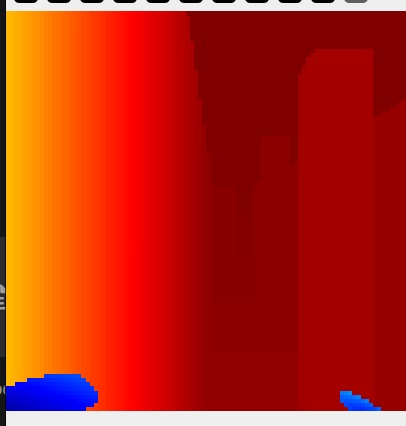
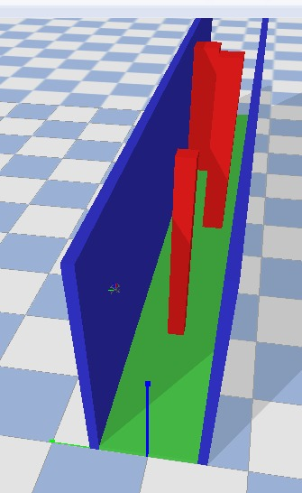
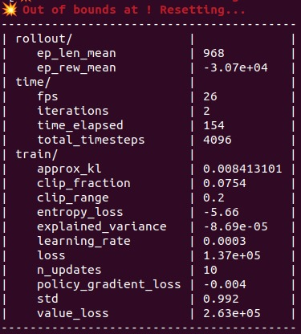
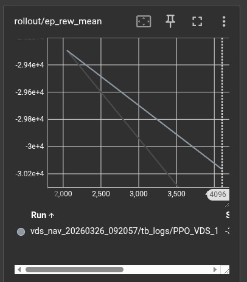

# VDS-NAV

Depth images guided open exploration for drones
Paper: https://ieeexplore.ieee.org/document/11152316

***NOTE: This is just an unofficial implementation of the paper. No model was trained due to insufficient compute capacity.***


## Overview

<table>
  <tr>
    <td align="center">
      <br/>
      <sub>Depth map as seem by the drone</sub>
    </td>
    <td align="center">
      <br/>
      <sub>Hallway environment with 3 obstacles</sub>
    </td>
  </tr>
  <tr>
    <td align="center">
      <br/>
      <sub>RL PPO</sub>
    </td>
    <td align="center">
      <br/>
      <sub>TensorBoard training metrics</sub>
    </td>
  </tr>
</table>


## Install

```bash
git clone https://github.com/AvishkarArjan/vds-nav.git
cd vds-nav
conda env create -f environment.yml
conda activate vds-nav
```

## Training

```bash
python train.py
```

## Visualize training

```bash
tensorboard --logdir=results
```
